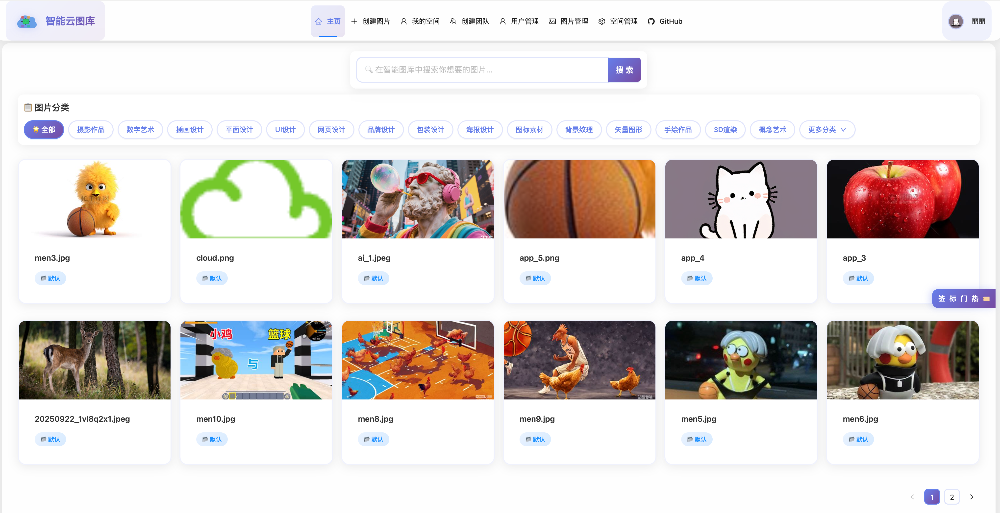
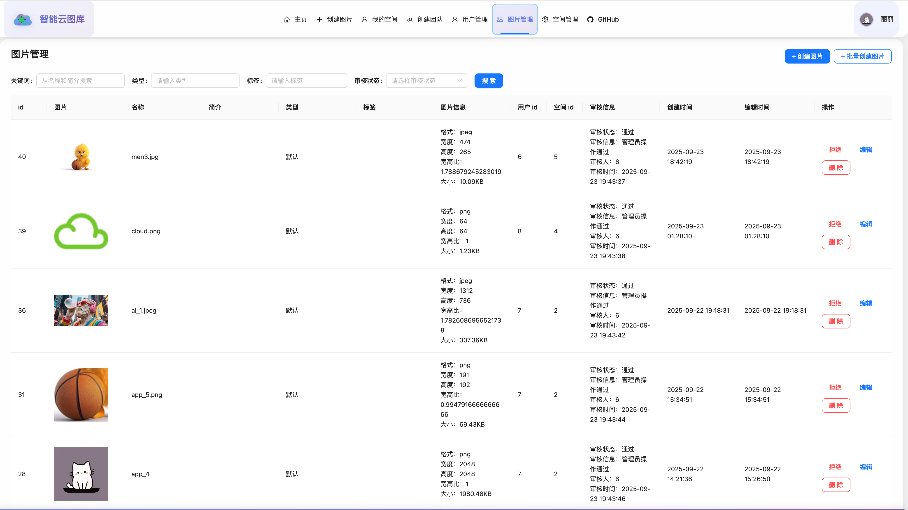
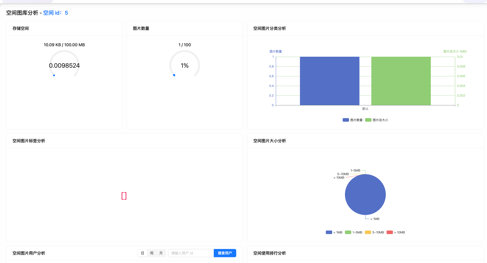

# 智能云图库 (Cloud Picture Library)

一个基于 Go + Vue3 的现代化图片管理系统，支持图片上传、管理、协同编辑和空间管理等功能。

## 🛠️ 技术栈

### 后端技术
- **Go 1.23+**: 主要开发语言
- **GoFrame v2**: Web框架和ORM
- **MySQL 8.0+**: 主数据库
- **Redis**: 缓存和会话存储
- **WebSocket**: 实时通信
- **腾讯云COS**: 对象存储服务
- **火山引擎**: AI服务集成
```

## 🚀 快速开始

### 1. 克隆项目

```bash
git clone https://github.com/your-username/cloud-picture-library.git
cd cloud-picture-library
```

### 2. 数据库配置

```bash
# 创建数据库
mysql -u root -p
CREATE DATABASE cloud_picture CHARACTER SET utf8mb4 COLLATE utf8mb4_unicode_ci;

# 导入数据库结构
mysql -u root -p cloud_picture < cloud_picture.sql
```

### 3. 后端配置

```bash
# 复制配置文件
cp manifest/config/config.yaml.example manifest/config/config.yaml

# 编辑配置文件，修改数据库连接信息
vim manifest/config/config.yaml
```

配置文件示例：
```yaml
server:
  address: ":8123"

database:
  default:
    link: "mysql:root:password@tcp(localhost:3306)/cloud_picture"

redis:
  default:
    address: 127.0.0.1:6379
    db: 0
```

### 4. 启动后端服务

```bash
# 安装依赖
go mod tidy

# 启动服务
go run main.go
```

### 5. 启动前端服务

```bash
cd picture-frontend

# 安装依赖
npm install

# 启动开发服务器
npm run dev
```

## 📊 功能截图

### 首页


### 图片管理


### 空间分析


### 以图生图
https://github.com/user-attachments/assets/a4bbb53b-6787-4f09-9255-ca18844cafa8

### 批量爬取图片
https://github.com/user-attachments/assets/b008e730-bff9-49b5-aa0b-4fb772eee90d

### 协同编辑


⭐ 如果这个项目对您有帮助，请给们一个星标！