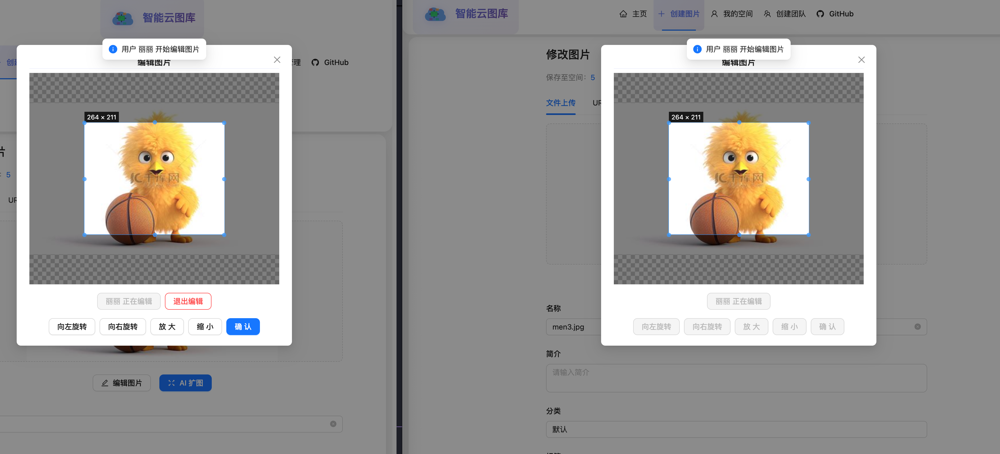

# 智能云图库 (Cloud Picture Library)

一个基于 Go + Vue3 的现代化图片管理系统，支持图片上传、管理、协同编辑和空间管理等功能。

## 🌟 项目特色

- **🎨 智能图片管理**: 支持多种图片格式，自动提取图片信息和颜色特征
- **👥 团队协作**: 支持团队空间和实时协同编辑
- **🔐 权限管理**: 细粒度的用户权限控制
- **📊 数据分析**: 丰富的空间使用分析和统计功能
- **🌐 现代化UI**: 基于 Ant Design Vue 的美观界面
- **⚡ 高性能**: Go 后端 + Vue3 前端，响应迅速

## 🛠️ 技术栈

### 后端技术
- **Go 1.23+**: 主要开发语言
- **GoFrame v2**: Web框架和ORM
- **MySQL 8.0+**: 主数据库
- **Redis**: 缓存和会话存储
- **WebSocket**: 实时通信
- **腾讯云COS**: 对象存储服务
- **火山引擎**: AI服务集成

## 🚀 核心功能

### 图片管理
- 📤 **批量上传**: 支持单张和批量图片上传
- 🏷️ **智能标签**: 自动提取图片特征，支持自定义标签
- 🔍 **高级搜索**: 按分类、标签、关键词搜索图片
- ✂️ **在线编辑**: 支持图片裁剪、旋转等基础编辑功能
- 🎨 **AI编辑**: 集成AI图片编辑功能（外扩、智能编辑等）

### 空间管理
- 🏠 **个人空间**: 每个用户拥有独立的图片空间
- 👥 **团队空间**: 支持创建团队空间，多人协作
- 📈 **空间分析**: 详细的空间使用统计和分析
- 💾 **存储管理**: 支持不同级别的存储空间（普通版/专业版/旗舰版）

### 用户系统
- 🔐 **用户认证**: 完整的注册、登录、权限验证
- 👤 **个人中心**: 个人信息管理和设置
- 🛡️ **角色管理**: 支持普通用户和管理员角色
- 📊 **用户分析**: 用户行为和使用统计

### 协同编辑
- 🤝 **实时协作**: 基于 WebSocket 的实时协同编辑
- 🔒 **编辑锁定**: 防止多人同时编辑冲突
- 📢 **状态同步**: 实时同步编辑状态和操作
- 💬 **消息通知**: 编辑状态变化通知

```

## 🚀 快速开始

### 环境要求

- Go 1.23+
- Node.js 18+
- MySQL 8.0+
- Redis 6.0+

### 1. 克隆项目

```bash
git clone https://github.com/your-username/cloud-picture-library.git
cd cloud-picture-library
```

### 2. 数据库配置

```bash
# 创建数据库
mysql -u root -p
CREATE DATABASE cloud_picture CHARACTER SET utf8mb4 COLLATE utf8mb4_unicode_ci;

# 导入数据库结构
mysql -u root -p cloud_picture < cloud_picture.sql
```

### 3. 后端配置

```bash
# 复制配置文件
cp manifest/config/config.yaml.example manifest/config/config.yaml

# 编辑配置文件，修改数据库连接信息
vim manifest/config/config.yaml
```

配置文件示例：
```yaml
server:
  address: ":8123"

database:
  default:
    link: "mysql:root:password@tcp(localhost:3306)/cloud_picture"

redis:
  default:
    address: 127.0.0.1:6379
    db: 0
```

### 4. 启动后端服务

```bash
# 安装依赖
go mod tidy

# 启动服务
go run main.go
```

### 5. 启动前端服务

```bash
cd picture-frontend

# 安装依赖
npm install

# 启动开发服务器
npm run dev
```

### 6. 访问应用

- 前端地址: http://localhost:5173
- 后端API: http://localhost:8123
- API文档: http://localhost:8123/swagger
```

## 📊 功能截图

### 首页


### 图片管理


### 空间分析

git
### 协同编辑



⭐ 如果这个项目对您有帮助，请给我们一个星标！
